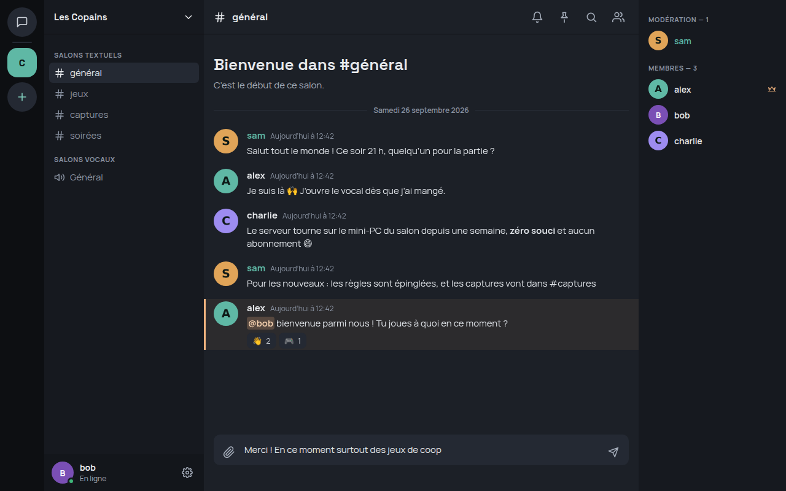

# Quarel

**Alternative libre et auto-hébergeable à Discord** : chaque serveur tourne chez la personne qui l'héberge ; messages privés et appels chiffrés de bout en bout.

- Site et documentation : **[quarel.app](https://quarel.app)**
- Application web : [app.quarel.app](https://app.quarel.app) — application de bureau Windows et Linux : [téléchargements](https://quarel.app/#telecharger)
- Héberger un serveur : [guide de l'hébergeur](https://quarel.app/wiki/heberger/serveur-communautaire/)
- Écrire un bot : [API des serveurs communautaires](https://quarel.app/wiki/developper/api/)
- Assistants IA : serveur MCP de la documentation sur `https://quarel.app/mcp` ([détails](https://quarel.app/wiki/developper/mcp/))

> Projet en **version de test**.

## Dans ce dépôt

Serveurs en Go (`cmd/`, `internal/`), application Electron + React (`client/`), site et wiki (`site/`), déploiements Docker (`deploy/`). Voir [CONTRIBUTING.md](CONTRIBUTING.md). Faille de sécurité : [SECURITY.md](SECURITY.md).

## Licence

Apache-2.0 — voir [LICENSE](LICENSE) et [NOTICE](NOTICE) pour les composants tiers.
